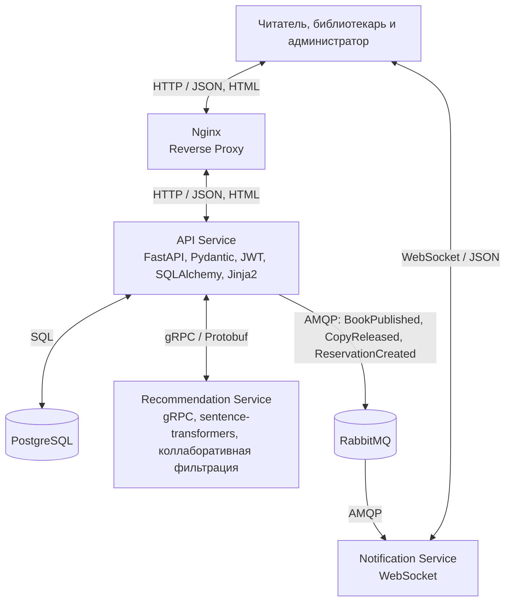
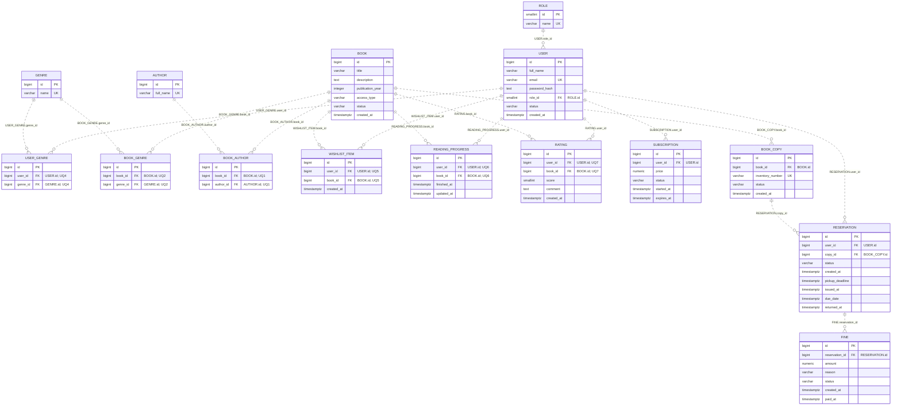

# Книжная полка / BookShelf

Приложение библиотеки: онлайн-чтение книг и бронирование бумажных экземпляров в читальном зале.
## Предметная область
Библиотека ведёт единый каталог книг. У книги может быть электронная версия для чтения в браузере и бумажные экземпляры на полках - по отдельности или вместе. Читатель читает электронные книги в браузере, бронирует бумажные экземпляры и забирает их в библиотеке. Часть электронных книг находится в свободном доступе, остальные открываются по месячной подписке. Подписка также даёт право бронировать бумажные экземпляры, поэтому читальный зал и платный электронный каталог открываются одной оплатой. Сервис подбирает книги по интересам читателя и уведомляет его о подходящих новинках и об освобождении нужного экземпляра.
## Бизнес-цель
Создать MVP библиотечного сервиса, который объединяет электронный читальный зал и бронирование бумажных книг в одном каталоге и зарабатывает на месячной подписке. Подписка открывает платную часть электронного каталога и право брать бумажные книги; каталог свободного доступа остаётся бесплатным.

Измеримые ориентиры MVP:
- бумажный экземпляр бронируется без визита в библиотеку, не более чем за три действия от карточки книги;
- читателю с одной оценённой книгой доступна персональная подборка не менее чем из десяти книг;
- уведомление доходит до подключённого клиента в течение секунды после события в API.
- Читателю предлагается подборка книг по его интересам

## Основные сценарии

1. **Регистрация:** пользователь вводит имя, email и пароль, создаёт аккаунт читателя, отмечает интересующие жанры, затем входит и получает JWT-токен. Аккаунты библиотекарей создаёт администратор.
2. **Поиск книги:** читатель открывает каталог, фильтрует книги по жанру и автору или ищет по названию, открывает карточку книги и видит описание, доступность онлайн и число свободных экземпляров.
3. **Чтение онлайн:** читатель открывает книгу свободного доступа и читает её текст в браузере. Сервер сохраняет позицию, на которой читатель остановился, чтобы тот мог продолжить с того же места.
4. **Подписка:** чтобы открыть платную книгу или забронировать бумажный экземпляр, читатель оформляет месячную подписку в личном кабинете. После активации доступны все подписные книги каталога и бронирование в читальном зале.
5. **Оценка:** дочитав книгу до конца или вернув бумажный экземпляр, читатель ставит оценку от 1 до 10 и при желании оставляет комментарий. Свою оценку можно изменить или удалить.
6. **Рекомендации:** читатель открывает подборку книг, похожих на те, которым он поставил высокие оценки, и на отмеченные им жанры. Уже прочитанные, оценённые и неопубликованные книги исключаются.
7. **Список «хочу прочитать»:** читатель добавляет книгу в список из её карточки. Список используется как очередь ожидания для уведомлений об освобождении экземпляра.
8. **Бронирование:** читатель с активной подпиской нажимает «Забронировать» в карточке книги со свободными экземплярами. Сервер проверяет подписку, закрепляет за читателем один свободный экземпляр и назначает срок, до которого книгу нужно забрать.
9. **Выдача и возврат:** читатель приходит в библиотеку, библиотекарь находит бронь и отмечает выдачу - с этого момента идёт срок чтения. При возврате библиотекарь отмечает приём, и экземпляр снова становится свободным.
10. **Просрочка:** если читатель вернул книгу позже срока, сервер при приёме начисляет пеню за каждые полные сутки просрочки. Неоплаченный штраф запрещает новые брони, пока библиотекарь не отметит оплату.
11. **Наполнение каталога:** библиотекарь создаёт черновик книги, заполняет описание, авторов и жанры, загружает текст электронной версии и ставит на учёт бумажные экземпляры, затем публикует книгу.
12. **Уведомления:** уведомления приходят в открытый личный кабинет через RabbitMQ и Notification Service по WebSocket; отправка на email не предусмотрена. Предусмотрены три события:
	- опубликована книга в жанре, который читатель отметил как интересный;
	- освободился экземпляр книги из списка «хочу прочитать» читателя;
	- создана новая бронь - уведомление получают библиотекари, чтобы подготовить экземпляр к выдаче.
13. **Администрирование:** администратор открывает список пользователей, заводит библиотекаря, блокирует нарушителя, правит справочники жанров и авторов и просматривает статистику.

### Правила бронирования и подписки
У читателя одновременно не более трёх активных броней и выданных книг. Второй экземпляр одной и той же книги забронировать нельзя. Бронь действует 48 часов: если читатель не забрал книгу, бронь истекает, а экземпляр возвращается в свободные. Срок чтения бумажной книги - 14 дней, за каждые полные сутки просрочки начисляется фиксированная пеня. Бронировать может только читатель с активной подпиской. Бронирование запрещено при наличии просроченной выдачи или неоплаченного штрафа. Если экземпляр утерян, библиотекарь отмечает это и сервер начисляет фиксированный штраф за утерю.
Просроченные брони не требуют планировщика: они переводятся в истёкшие при следующем обращении к книге или экземпляру, а до возврата книги размер пени показывается расчётно и в базе не хранится.
Подписка оформляется на месяц и активируется сразу. Одновременно активна не более чем одна подписка; продление создаёт новую запись, начинающуюся с даты окончания текущей. После истечения подписки книги свободного доступа и прогресс чтения остаются доступными, подписные книги закрываются, а новые брони становятся недоступны. Если подписка закончилась, пока книга на руках, читатель дочитывает её до назначенного срока возврата, а уже созданная бронь действует до своего срока получения: истечение подписки не сокращает эти сроки и не освобождает от штрафа за просрочку. В учебном MVP стоимость подписки указана в рублях справочно, приём платежей предусмотрен как дальнейшее развитие.

## Роли
### Читатель
- регистрируется, входит в систему и отмечает интересующие жанры;
- ищет книги по названию, автору и жанру;
- читает книги свободного доступа онлайн;
- оформляет подписку, читает книги платного каталога и получает право бронировать бумажные экземпляры;
- ставит книге оценку от 1 до 10 после прочтения;
- ведёт список «хочу прочитать»;
- бронирует бумажный экземпляр по действующей подписке и забирает его в библиотеке;
- следит за сроком возврата и начисленными штрафами;
- получает персональные рекомендации;
- получает уведомления о новинках и об освобождении экземпляров.
### Библиотекарь
- ведёт каталог: создаёт книги, загружает текст электронной версии, добавляет авторов и жанры, публикует и архивирует книги;
- управляет экземплярами: ставит на учёт, списывает, отмечает утерянные;
- выдаёт забронированные экземпляры и принимает возврат;
- фиксирует оплату штрафов;
- получает уведомления о новых бронях.
### Администратор
- заводит учётные записи библиотекарей;
- блокирует и разблокирует читателей;
- ведёт справочники жанров и авторов;
- просматривает статистику по каталогу, выдачам и подпискам.

**Особенности:**
- Для защищённых HTTP- и WebSocket-запросов проверяются подлинность и срок действия JWT; пользователь определяется по токену.
- Регистрация и авторизация выполняются без токена.
- Пароли хранятся в виде хэшей с солью.
- Заблокированный читатель не может войти в систему или бронировать книги.
- У аккаунта может быть только одна роль:
	- `READER` - управляет своими бронями, списками и оценками;
	- `LIBRARIAN` - управляет каталогом и выдачей;
	- `ADMIN` - управляет пользователями и справочниками.

## Архитектура

- **API Service** принимает и обрабатывает запросы, проверяет права доступа, реализует основную бизнес-логику и формирует HTML-страницы с помощью Jinja2.
- **PostgreSQL** хранит данные о пользователях, каталоге, экземплярах книг, бронированиях и истории чтения.
- **Рекомендательный сервис** находит похожие книги и взаимодействует с другими сервисами через gRPC.
- **RabbitMQ** обеспечивает обмен событиями между сервисами.
- **Nginx** принимает внешние запросы, обслуживает статические файлы и перенаправляет остальные запросы в **API Service**.
- **Сервис уведомлений** отправляет уведомления подключённым клиентам через WebSocket.

**Особенности:**
- Аутентификация и управление доступом к данным реализованы в **API Service**.
- Серверные компоненты запускаются в отдельных контейнерах **Docker Compose**.
- Для **PostgreSQL** используется постоянный том, а конфигурационные параметры - сроки бронирования и чтения, размер пени, стоимость подписки и настройки подключения - задаются через переменные окружения.
- Для демонстрации достаточно HTTP-клиента и отдельного WebSocket-клиента;
- Веб-интерфейс на **Jinja2** будет реализован в рамках отдельной лабораторной работы.

### Рекомендательный сервис
Рекомендации строятся гибридным подходом: из двух сигналов, которые складываются во взвешенную сумму: содержательной близости описаний и коллаборативной близости по оценкам.

**Содержательный сигнал.** Профиль читателя собирается из описаний и жанров книг, которым он поставил высокие оценки, и из жанров, отмеченных им в интересах. Кандидаты - опубликованные книги, которые читатель не читал (не отмечал прочитанными) и не оценивал. Текст кандидата и профиля переводится в векторное представление предобученной моделью эмбеддингов предложений (например `sentence-transformers/all-MiniLM-L6-v2`); мера близоксти - косинус.

_Пока что дообучать модель не планируется, так как домен книг планируется очень широкий (и художественный, и технический). Единственное требование - мультиязычность_

**Коллаборативный сигнал.** Дополнительно считается схожесть книг по паттерну совпадения оценок разных читателей (item-based, adjusted cosine по матрице книга × пользователь). Сигнал доступен только для книг, у которых есть достаточно оценок.
**Смешивание.** Итоговый балл кандидата:$$score = \alpha \cdot score_{content} + (1-\alpha) \cdot score_{CF}$$ где $\alpha$ тем больше, чем меньше оценок собрала книга-кандидат (при `ratings_count = 0` вес коллаборативного сигнала равен нулю, работает чистый content-score). Вклад каждой оценённой читателем книги в обоих сигналах взвешивается её оценкой.
### Уведомления о событиях и события

|Событие|Когда публикуется|Кто получает уведомление|
|---|---|---|
|`BookPublished`|библиотекарь опубликовал книгу|читатели, отметившие хотя бы один жанр этой книги|
|`CopyReleased`|экземпляр стал свободным после возврата, отмены или истечения брони|читатели, у которых книга есть в списке «хочу прочитать»|
|`ReservationCreated`|читатель создал бронь|библиотекари|

Событие публикуется после изменения БД. API Service, владеющий базой, определяет получателей и передаёт их в событии; Сервис уведомлений доставляет уведомление и к БД не обращается.
Событие содержит `event_id`, ID книги и получателей, а также данные для отображения: название книги, для брони - инвентарный номер и срок получения. RabbitMQ подтверждает доставку, повторы используют тот же `event_id`, дубликаты отбрасываются.
Экземпляр не закрепляется за читателем: уведомление получают все ожидающие, а бронь оформляет первый. От двойной брони защищает ограничение БД.
В MVP не гарантируются доставка при сбое между БД и брокером и офлайн-доставка. Актуальные списки броней и новинок доступны через API.

## Структура базы данных

Метка рядом с парой полей (например, `uq_book_author`) означает, что на эту пару полей в БД наложено составное ограничение `UNIQUE`; по отдельности каждое поле пары не уникально. `UK` обозначает уникальность отдельного поля.

### Внешние ключи

|Таблица и столбец|Ссылается на|Назначение|
|---|---|---|
|`users.role_id`|`roles.id`|роль пользователя|
|`user_genres.user_id`|`users.id`|читатель, отметивший интерес|
|`user_genres.genre_id`|`genres.id`|интересующий жанр|
|`book_authors.book_id`|`books.id`|книга|
|`book_authors.author_id`|`authors.id`|автор книги|
|`book_genres.book_id`|`books.id`|книга|
|`book_genres.genre_id`|`genres.id`|жанр книги|
|`wishlist_items.user_id`|`users.id`|читатель, ведущий список|
|`wishlist_items.book_id`|`books.id`|книга в списке «хочу прочитать»|
|`reading_progress.user_id`|`users.id`|читатель|
|`reading_progress.book_id`|`books.id`|читаемая книга|
|`ratings.user_id`|`users.id`|автор оценки|
|`ratings.book_id`|`books.id`|оцениваемая книга|
|`subscriptions.user_id`|`users.id`|подписчик|
|`book_copies.book_id`|`books.id`|книга, экземпляром которой является запись|
|`reservations.user_id`|`users.id`|читатель, оформивший бронь|
|`reservations.copy_id`|`book_copies.id`|забронированный экземпляр|
|`fines.reservation_id`|`reservations.id`|бронь, по которой начислен штраф|

`BookGenre` и `BookAuthor` реализуют связи "многие ко многим" между книгами, жанрами и авторами. `UserGenre` связывает читателей с интересующими жанрами, `WishlistItem` и `Rating` - читателей с книгами. `BookCopy` отделяет физический экземпляр от произведения: у одной книги несколько экземпляров, и каждый бронируется независимо. `Reservation` связывает читателя с конкретным экземпляром и хранит этапы брони.

### Физическая схема и ограничения
- Все `id` генерируются PostgreSQL через `IDENTITY`; типы PK и FK соответствуют диаграмме.
- `varchar` имеет размер `255`, для статусов и типа доступа используется `VARCHAR(20)`, для инвентарного номера - `VARCHAR(50)`. Поля `text` имеют тип `TEXT`.
- Стоимость подписки и штраф задаются как `NUMERIC(12,2)`, оценка - `SMALLINT`, даты - `TIMESTAMPTZ`. Поле `created_at` получает значение `now()` по умолчанию.
- Все поля обязательны, кроме `text_content` (пусто у книг без электронной версии), `finished_at`, `comment`, `publication_year`, `paid_at`, а также `issued_at`, `due_date` и `returned_at`, которые заполняются по мере прохождения этапов бронирования.
- Жанры и авторы нормализуются удалением лишних пробелов и приведением регистра. Их уникальность, как и уникальность ролей и инвентарных номеров, контролируется базой данных.
- Названия книг и отдельные внешние ключи не уникальны. Составные ограничения обозначаются именами `uq_*`.
- Email нормализуется сервисом: пробелы по краям удаляются, адрес переводится в нижний регистр.
- У читателя может быть только одна активная подписка. Это обеспечивается частичным уникальным индексом по `subscriptions.user_id` при `status = 'ACTIVE'`.
- Для внешних ключей используется `ON DELETE RESTRICT`. FK-поля и поля `book_copies.status`, `reservations.status` индексируются для ускорения поиска.

### Правила целостности и статусы
Бизнес-правила выполняет сервисный слой API Service через SQLAlchemy. Он проверяет права, роли (`READER`/`LIBRARIAN`/`ADMIN`), статусы пользователей (`ACTIVE`/`BLOCKED`), переходы книг (`DRAFT` $\rightarrow$ `PUBLISHED` $\rightarrow$ `ARCHIVED`), оценки от 1 до 10 и неотрицательные суммы. Обязательные строки не могут быть пустыми. БД обеспечивает `PK`, `FK`, `UNIQUE`, `NOT NULL` и защиту от конкурентных дубликатов. Логика не зависит от триггеров и хранимых процедур.
`access_type` книги:
- `FREE` - электронная версия доступна всем;
- `SUBSCRIPTION` - нужна активная подписка;
- `NONE` - электронной версии нет.

Для `NONE` поле `text_content` пустое, для остальных заполнено. Публикация возможна при наличии описания, автора, жанра и хотя бы одного способа получения: электронной версии или бумажного экземпляра. После публикации текст книги не меняется, чтобы сохранялись позиции читателей; остальные сведения можно менять. Архивная книга скрывается из каталога и недоступна для новых броней, но остаётся доступной тем, кто уже читает её или держит экземпляр. Удалять можно только черновики: связи и невыдававшиеся экземпляры удаляются одной транзакцией. Пользователей, жанры и авторов с зависимостями удалять нельзя.

Экземпляры имеют статусы `AVAILABLE`, `RESERVED`, `ISSUED`, `LOST`, `WRITTEN_OFF`. Бронь проходит `CREATED` $\rightarrow$ `ISSUED` $\rightarrow$ `RETURNED`; из `CREATED` возможны `CANCELLED` и `EXPIRED`, из `ISSUED` - `LOST`. Статусы брони и экземпляра меняются в одной транзакции. Операции с экземпляром сериализуются, поэтому двойная бронь невозможна. Бронировать можно только доступный экземпляр опубликованной книги и только читателю с активной подпиской; наличие подписки сервис проверяет в момент создания брони.

Штраф создаётся при возврате или фиксации утери: за просрочку - ставка, умноженная на число полных суток между `due_date` и `returned_at`; за утерю - фиксированная сумма. Статусы штрафа: `UNPAID` или `PAID`; оплату отмечает библиотекарь.

Прогресс хранится одной записью на читателя и книгу. `position` указывает смещение в тексте, на котором читатель остановился, `finished_at` заполняется, когда позиция достигает конца текста. Сервер проверяет, что позиция не выходит за пределы текста, и наличие доступа к электронной версии. Оценку можно поставить после завершения электронного чтения или возврата бумажного экземпляра; на книгу допускается одна оценка. При отсутствии оценок средний балл не определяется.

## Технологии
| Компонент         | Технология                          | Назначение                                                                                                           |
| ----------------- | ----------------------------------- | -------------------------------------------------------------------------------------------------------------------- |
| REST API          | FastAPI, Pydantic                   | HTTP-эндпоинты, проверка входных данных и формирование JSON-ответов; DTO не связаны напрямую с ORM-моделями          |
| Обратный прокси   | Nginx                               | Маршрутизация входящих запросов, обслуживание статических файлов и организация единой точки доступа                  |
| Аутентификация    | JWT                                 | Идентификация пользователей с помощью токенов и контроль доступа к объектам системы                                  |
| Очередь сообщений | RabbitMQ                            | Асинхронная доставка событий между компонентами системы и передача данных сервису уведомлений                        |
| База данных       | PostgreSQL, SQLAlchemy              | Хранение данных, управление связями между сущностями, обеспечение целостности, транзакций и взаимодействие через ORM |
| Миграции          | Alembic                             | Управление изменениями структуры базы данных и последовательное обновление её схемы                                  |
| Рекомендации      | gRPC, Protocol Buffers              | Синхронное взаимодействие с отдельным сервисом через строго типизированный протокол                                  |
| Подбор книг       | sentence-transformers, scikit-learn | Формирование рекомендаций на основе смыслового сходства описаний и анализа пользовательских оценок                   |
| Уведомления       | WebSocket                           | Мгновенная отправка сообщений пользователям через установленные соединения                                           |
| Веб-интерфейс     | Jinja2                              | Генерация HTML-страниц на сервере с использованием существующей бизнес-логики                                        |
| Запуск            | Docker Compose                      | Оркестрация контейнеров, настройка их взаимодействия, общей сети и параметров запуска                                |
## План реализации

| Этап             | Результат                                       |
| ---------------- | ----------------------------------------------- |
| Лабораторная № 0 | Техническое задание, архитектура и схема БД     |
| Лабораторная № 1 | PostgreSQL, SQLAlchemy и CRUD; миграции Alembic |
| Лабораторная № 2 | REST API, JWT и Nginx                           |
| Лабораторная № 3 | Recommendation Service и gRPC                   |
| Лабораторная № 4 | RabbitMQ и WebSocket-уведомления                |
| Лабораторная № 5 | Docker Compose                                  |
| Лабораторная № 6 | Веб-интерфейс на Jinja2                         |
## Правила ведения коммитов
Каждый коммит начинается с приставки: `<тип>/<текст коммита>`

| Тип | Описание |
| --- | --- |
| `init` | Создание структуры проекта |
| `fix` | Фикс ошибок, багов, неточностей |
| `feature` | Новый функционал |
| `refactor` | Улучшение кода без изменения функционала |
| `test` | Обновление модулей для тестирования |
| `style` | Форматирование кода |
| `chore` | Зависимости, конфигурация и служебные задачи |
| `ci` | Настройка автотестов и сборки |
| `docs` | Документация |

